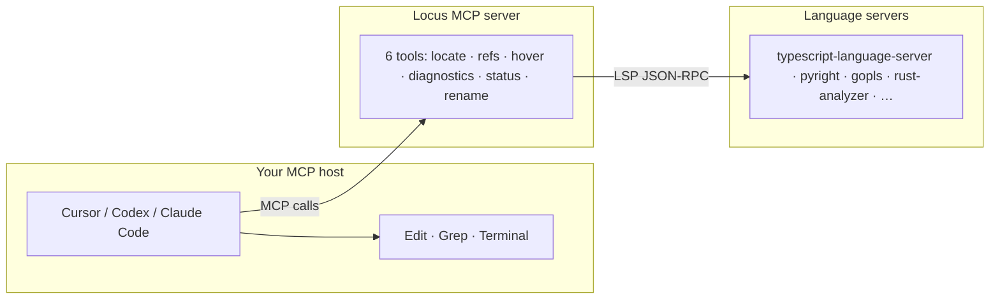

# Locus

<h3 align="center">Ground truth for your coding agent — without the weight of a full IDE toolkit.</h3>

<p align="center"><strong>Lightweight LSP intelligence for AI agents. 6 tools. Symbol-first. No IDE replacement.</strong></p>

[](https://www.npmjs.com/package/@locus-dev/mcp)
[](LICENSE)
[](https://nodejs.org/)
[](https://github.com/paladini/locus-mcp/actions/workflows/ci.yml)

**Locus** is an open-source [Model Context Protocol (MCP)](https://modelcontextprotocol.io) server that connects AI coding agents to [Language Server Protocol (LSP)](https://microsoft.github.io/language-server-protocol/) backends. Agents get **symbol-level navigation** — not a second IDE — through six curated tools and compact, context-efficient output.

> **Who is the end user?** Your **AI agent**. You install and configure Locus once; the agent calls MCP tools during every session. Humans use the CLI only for setup.

---

## What Locus gives your agent

Most agents still navigate code by reading whole files and grepping text. That burns context and misses semantics — wrong overload, stale string match, no type information.

Locus adds the **semantic layer** language servers already provide to human developers:

| Without Locus | With Locus |
|---------------|------------|
| Grep for `"processOrder"` and hope | `locate` finds the symbol the compiler knows |
| Read 400 lines to find callers | `refs` returns every reference in compact lines |
| Guess types from variable names | `hover` returns LSP type info and docs |
| Miss errors until build time | `diagnostics` surfaces compiler warnings early |

Locus is **navigation and diagnostics only**. Your MCP host (Cursor, Claude Code, Codex, etc.) already handles file edits, terminal commands, and search — Locus does not replace those. It gives your agent **ground-truth LSP answers** with minimal tool surface.

> **Important:** Locus does not symbolic-edit code, store project memory, or expose dozens of IDE tools. Use your host for edits; use Locus for **where things are defined, what references them, and what's broken**.

---

## For agent users: configure MCP, not CLI

**MCP is the product.** Your agent calls six MCP tools — it does **not** run `locus locate` in a terminal.

The CLI exists to **set up and launch** the MCP server:

| Command | Purpose |
|---------|---------|
| `locus serve` | Starts the MCP server (stdio) — **spawned by Cursor, Codex, Claude Code** |
| `locus init` | Generate project config (one-time) |
| `locus check` | Verify language-server binaries |
| `locus warm` | Pre-start language servers (optional) |

**Full guide:** [docs/usage.md](docs/usage.md)

### Cursor

```json
{
  "mcpServers": {
    "locus": {
      "command": "npx",
      "args": ["-y", "@locus-dev/mcp", "serve"],
      "cwd": "/absolute/path/to/your/project"
    }
  }
}
```

### Codex

```toml
[mcp_servers.locus]
command = "npx"
args = ["-y", "@locus-dev/mcp", "serve"]
cwd = "/absolute/path/to/your/project"
```

### Claude Code

Add the same `npx @locus-dev/mcp serve` launch command to your Claude Code MCP config with `cwd` set to your project root. See [docs/usage.md](docs/usage.md) for step-by-step setup.

---

## Why lightweight matters

**Lightweight** here means lighter to **adopt and operate daily** — not "always fewer tokens for every task." Locus is a lean TypeScript MCP bridge with six curated tools. Serena is a full Python agent toolkit with symbolic editing, memory, and shell. Both use LSP; the weight class is different.

| | **grep / ripgrep** | **Serena** | **Locus** |
|---|-------------------|------------|-----------|
| **Install** | Already in your shell | `uv tool install serena-agent` + Python ecosystem | `npx @locus-dev/mcp` (Node.js 22+) |
| **Runtime stack** | Native binary | Python agent toolkit + LSP backends | Lean TypeScript MCP bridge + LSP backends |
| **MCP tool count** | n/a (host Grep) | Many (edit, memory, shell, find, refactor, …) | **6 curated tools** |
| **Agent cognitive load** | Low — one search primitive | High — large tool menu, more context pollution | **Low — small menu, faster tool selection** |
| **RAM / complexity** | Minimal | Heavier — full agent IDE surface | **Minimal bridge** — navigation + diagnostics only |
| **Scope** | Text search | IDE replacement inside MCP | **Navigation + diagnostics only** |
| **Symbolic editing** | no | yes (`replace_symbol_body`, …) | **no** (use host Edit tools) |
| **Agent memory** | no | yes | **no** |
| **Languages (built-in)** | All text files | 40+ via LSP backends | **4** (TS/JS, Python, Go, Rust — extensible via config) |
| **Best use case** | Strings, logs, config keys | Full symbolic refactors, memory, one MCP stack for everything | **Thin LSP layer** when your host already edits well |

### Honest caveats

- **Serena can be more token-efficient for large symbolic refactors** — one `replace_symbol_body` vs many host edits.
- **Serena supports 40+ languages** out of the box; Locus ships four built-ins (extensible via `locus.json` / `.lsp.json`).
- **"Lightweight" ≠ "always fewer tokens."** For navigation and diagnostics, Locus wins on install friction, tool-surface size, and daily operation. For heavy symbolic rewrites, Serena's edit toolkit can cost less per operation.

### vs grep-only

Grep finds text. Locus finds **symbols** — the function, class, or type your language server understands. Use both: grep for strings and logs; Locus for definitions, references, types, and compiler diagnostics.

Serena is excellent when you want a broad IDE toolkit inside the agent. **Locus is for teams that already have a capable host** and want a thin, predictable LSP layer — not a second IDE.

Honest deep dive: [docs/comparison.md](docs/comparison.md) · [docs/positioning.md](docs/positioning.md) · [docs/faq.md](docs/faq.md#is-locus-just-a-lighter-serena)

---

## Quick start

Three steps — MCP first:

1. **Add Locus to your MCP host** (Cursor, Codex, or Claude Code) with `npx -y @locus-dev/mcp serve` and `cwd` pointing at your project — see [docs/usage.md](docs/usage.md).
2. **One-time project setup:**

```bash
npx @locus-dev/mcp init    # generate locus.toml + locus.json
npx @locus-dev/mcp check   # verify language-server binaries
```

3. **Start coding with your agent.** The host spawns `locus serve` automatically. Optional: `npx @locus-dev/mcp warm` to reduce cold-start latency.

**Prerequisites:** Node.js 22+ and language servers on your `PATH` ([install guide](docs/getting-started.md#installing-language-servers)).

---

## What agents gain

*Expected outcomes from adding Locus to an agent workflow — not testimonials; real evals coming soon.*

> **Fewer blind file reads** — jump to the definition instead of scanning entire modules.

> **Accurate refactors** — find every reference via LSP, not regex that misses re-exports.

> **Type-aware reasoning** — hover returns what the compiler knows, not what the model guesses.

> **Early error detection** — workspace diagnostics before the agent proposes a broken patch.

> **Stable tool surface** — six tools with predictable compact output; less context spent parsing JSON.

> **Host stays in charge** — Edit, Grep, and terminal tools from your IDE; Locus adds semantics on top.

---

## How Locus works



Your agent calls high-level MCP tools. Locus translates them to LSP requests, resolves symbols, and returns **compact line-oriented text** designed for LLM context efficiency — not raw LSP payloads.

Architecture details: [docs/design.md](docs/design.md)

---

## The six MCP tools

| Tool | What your agent gets |
|------|----------------------|
| [`locate`](docs/tools.md#locate) | Find a symbol by name (including qualified names) or list symbols in a file |
| [`refs`](docs/tools.md#refs) | All references or implementations at a position |
| [`hover`](docs/tools.md#hover) | Type information and documentation |
| [`diagnostics`](docs/tools.md#diagnostics) | File or workspace errors and warnings |
| [`status`](docs/tools.md#status) | Language-server readiness and missing binaries |
| [`rename`](docs/tools.md#rename) | Preview a rename (dry-run by default; apply via host edits) |

Full reference with examples: [docs/tools.md](docs/tools.md)

---

## Language support

Built-in adapters (extensible via `locus.json` or `.lsp.json`):

| Language | Language server |
|----------|-----------------|
| TypeScript / JavaScript | `typescript-language-server` |
| Python | `pyright-langserver` |
| Go | `gopls` |
| Rust | `rust-analyzer` |

Run `locus check` to verify binaries. Configuration: [docs/configuration.md](docs/configuration.md)

---

## Documentation

| Guide | Description |
|-------|-------------|
| [**Usage (MCP-first)**](docs/usage.md) | Host setup, MCP vs CLI, agent workflows |
| [**Comparison**](docs/comparison.md) | Locus vs Serena, bridges, grep |
| [**Positioning**](docs/positioning.md) | When to choose Locus, go-to-market narrative |
| [**FAQ**](docs/faq.md) | Common questions |
| [Getting Started](docs/getting-started.md) | Install, prerequisites, first setup |
| [Tools](docs/tools.md) | All six MCP tools with examples |
| [Configuration](docs/configuration.md) | locus.toml, locus.json, .lsp.json |
| [Contributing](docs/contributing.md) | Dev setup and tests |

---

## Monorepo structure

```
packages/core/      @locus-dev/core — LSP client, registry, symbols, format
packages/mcp/       @locus-dev/mcp — MCP server + CLI
packages/adapters/  Cursor hooks + Claude skill (stubs in v0.1)
evals/              Evaluation fixtures
docs/               User and contributor guides
```

## Development

```bash
npm install
npm run build
npm run typecheck
npm test
```

See [CONTRIBUTING.md](CONTRIBUTING.md).

## License

[MIT](LICENSE)
