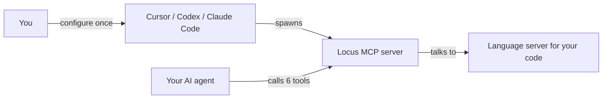

# Getting Started

You do not need to understand LSP (Language Server Protocol) to use Locus. Your AI agent reads and edits files; Locus gives it a direct line to the same "smart code understanding" your IDE uses — find definitions, trace references, read types, spot errors.

This guide gets you from zero to a working setup in a few minutes. No programming background required beyond using a terminal for setup commands.

## What you are setting up

**MCP** (Model Context Protocol) is how AI tools call helper servers. Locus is one such server: your agent host starts it in the background, and your agent calls its tools during conversations.



- **You** install prerequisites and paste an MCP config block.
- **Your agent host** starts Locus in the background.
- **Your agent** calls tools like `locate` and `refs` during conversations — not terminal commands.

## Step 1: Check prerequisites

| Requirement | What you need |
|-------------|---------------|
| Node.js | Version 22 or newer ([nodejs.org](https://nodejs.org)) |
| A language server | One per language you work in (see Step 2) |
| An MCP-capable agent | Cursor, Codex, Claude Code, or similar |

Open a terminal in your project folder and verify Node:

```bash
node --version
```

You should see `v22` or higher.

## Step 2: Install language servers

Locus does not analyze code by itself — it asks a **language server** (the same programs VS Code and Cursor use) for answers. Install the servers for languages in your project:

```bash
# TypeScript / JavaScript
npm install -g typescript-language-server typescript

# Python
pip install pyright

# Go
go install golang.org/x/tools/gopls@latest

# Rust
rustup component add rust-analyzer
```

Only install what you need. You can add more later.

## Step 3: One-time project setup

Run these in your **project root** (the folder with your code):

```bash
npx @paladini/locus-mcp init
npx @paladini/locus-mcp check
```

- `init` creates config files (`locus.toml`, `locus.json`) so Locus knows your project root and languages.
- `check` confirms language-server programs are installed and on your PATH.

Example successful check:

```
✓ typescript: typescript-language-server (found)
✓ python: pyright-langserver (found)
```

If something shows `MISSING`, install that language server and run `check` again.

Optional — pre-start servers before a long agent session:

```bash
npx @paladini/locus-mcp warm
```

## Step 4: Add Locus to your agent

Pick your tool and paste the config. Replace `/absolute/path/to/your/project` with your real project path.

**Cursor** — `.cursor/mcp.json`:

```json
{
  "mcpServers": {
    "locus": {
      "command": "npx",
      "args": ["-y", "@paladini/locus-mcp", "serve"],
      "cwd": "/absolute/path/to/your/project"
    }
  }
}
```

**Codex** — `~/.codex/config.toml` or `.codex/config.toml`:

```toml
[mcp_servers.locus]
command = "npx"
args = ["-y", "@paladini/locus-mcp", "serve"]
cwd = "/absolute/path/to/your/project"
```

**Claude Code** — MCP settings (same JSON shape as Cursor above).

Reload MCP servers or restart your agent host after saving.

## Step 5: Verify it works

Ask your agent:

> Call the Locus MCP tool `status` and tell me which language servers are ready.

If you get a readiness response (not an error about missing MCP), wiring is correct.

Then try something practical:

> Use Locus to find where `UserService` is defined in this project.

Your agent should call the `locate` tool — not run shell commands like `grep` or `locus locate` in a terminal.

## Common first-time issues

| Problem | Fix |
|---------|-----|
| `check` reports MISSING binary | Install that language server; ensure it is on your PATH |
| Agent uses grep instead of Locus | Remind it: *"Use the Locus MCP tool `locate`, not grep."* |
| `server_starting` in tool output | Wait a few seconds and retry, or run `npx @paladini/locus-mcp warm` |
| MCP server not listed in host | Confirm `cwd` is an absolute path to your project root; reload MCP |

## Installation options

**Recommended — no global install:**

```bash
npx @paladini/locus-mcp --help
```

**Global install:**

```bash
npm install -g @paladini/locus-mcp
```

**From source (contributors):**

```bash
git clone https://github.com/paladini/locus-mcp.git
cd locus-mcp
npm install
npm run build
```

For local development MCP config, see [usage.md](./usage.md).

## Next steps

- [Usage guide](./usage.md) — detailed host setup, example prompts, troubleshooting
- [FAQ](./faq.md) — "Do I need to be a programmer?", "What's MCP?", and more
- [Who is Locus for?](./positioning.md) — fit and alternatives
- [Tools reference](./tools.md) — what each of the six tools does
- [Configuration](./configuration.md) — customize languages and server paths
