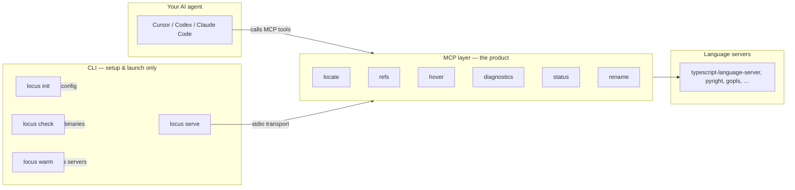

# Usage Guide — MCP First

**Locus is an MCP server.** Your AI agent (Cursor, Codex, Claude Code, etc.) calls six MCP tools for semantic code intelligence. The CLI exists to install, configure, and **launch** that server — not to be the product interface.

## MCP vs CLI — what is what?



| Layer | Role | Who uses it |
|-------|------|-------------|
| **MCP tools** | Semantic navigation — definitions, references, types, diagnostics | **Your agent** (automatically via MCP) |
| **`locus serve`** | Starts the MCP server over stdio | **MCP host config** (Cursor, Codex, etc. spawn this) |
| **`locus init` / `check` / `warm`** | One-time setup and ops | **You** (human), before or between agent sessions |

> **Important:** Agents never run `locus locate` in a terminal. They call the MCP tool `locate`. The CLI command `serve` is what your editor spawns behind the scenes.

---

## The six MCP tools

These are the only interface your agent needs:

| Tool | Purpose |
|------|---------|
| [`locate`](./tools.md#locate) | Find a symbol by name or list symbols in a file |
| [`refs`](./tools.md#refs) | Find references or implementations |
| [`hover`](./tools.md#hover) | Type info and documentation |
| [`diagnostics`](./tools.md#diagnostics) | File or workspace errors/warnings |
| [`status`](./tools.md#status) | Server readiness and missing binaries |
| [`rename`](./tools.md#rename) | Preview a rename (dry-run by default) |

Full parameter reference: [tools.md](./tools.md)

---

## CLI commands (setup & ops only)

```bash
locus serve [--cwd path]   # Start MCP server (stdio) — spawned by your MCP host
locus init  [--cwd path]   # Generate locus.toml + locus.json in a project
locus check [--cwd path]   # Verify language-server binaries are on PATH
locus warm  [--cwd path]   # Pre-start language servers (optional, reduces cold-start)
```

You typically run `init` and `check` once per project. Your MCP host runs `serve` automatically — you do not start it manually during normal agent use.

---

## Setup: Cursor

Add Locus to `.cursor/mcp.json` in your project (or global Cursor MCP settings).

### Published package (recommended)

```json
{
  "mcpServers": {
    "locus": {
      "command": "npx",
      "args": ["-y", "@locus-dev/mcp", "serve"],
      "cwd": "/absolute/path/to/your/project"
    }
  }
}
```

### Local development (from a Locus clone)

```json
{
  "mcpServers": {
    "locus": {
      "command": "node",
      "args": ["packages/mcp/dist/bin.js", "serve"],
      "cwd": "/absolute/path/to/locus-mcp"
    }
  }
}
```

For local dev analyzing a **different** project, point `cwd` at that project's root instead.

**Steps:**

1. Run `npx locus init` and `npx locus check` in your project root (one time).
2. Create or edit `.cursor/mcp.json` with the block above.
3. Set `cwd` to your project's absolute path.
4. Reload MCP servers in Cursor (or restart Cursor).

Cursor spawns `npx @locus-dev/mcp serve` and exposes the six tools to the agent.

---

## Setup: Codex

Codex reads MCP config from `~/.codex/config.toml` (global) or `.codex/config.toml` (project-scoped, trusted projects only).

### Global config (`~/.codex/config.toml`)

```toml
[mcp_servers.locus]
command = "npx"
args = ["-y", "@locus-dev/mcp", "serve"]
cwd = "/absolute/path/to/your/project"
```

### Project config (`.codex/config.toml`)

```toml
[mcp_servers.locus]
command = "npx"
args = ["-y", "@locus-dev/mcp", "serve"]
cwd = "."
```

Use `"."` when the config lives in the project you want analyzed. Codex resolves it relative to the project root.

### Local development

```toml
[mcp_servers.locus]
command = "node"
args = ["packages/mcp/dist/bin.js", "serve"]
cwd = "/absolute/path/to/locus-mcp"
```

**Steps:**

1. Run `npx locus init` and `npx locus check` in your project.
2. Add the `[mcp_servers.locus]` block to your Codex config.
3. Restart Codex CLI or reload the VS Code extension.

Optional: increase `startup_timeout_sec` if language servers are slow to boot:

```toml
[mcp_servers.locus]
command = "npx"
args = ["-y", "@locus-dev/mcp", "serve"]
cwd = "/absolute/path/to/your/project"
startup_timeout_sec = 30
```

Codex MCP reference: [developers.openai.com/codex/mcp](https://developers.openai.com/codex/mcp)

---

## Setup: Claude Code (brief)

Add the same stdio block to Claude Code MCP settings:

```json
{
  "mcpServers": {
    "locus": {
      "command": "npx",
      "args": ["-y", "@locus-dev/mcp", "serve"],
      "cwd": "/absolute/path/to/your/project"
    }
  }
}
```

Set `cwd` to the project root you want analyzed. Run `npx locus init` and `npx locus check` first.

---

## Agent workflows

These are patterns your agent should follow once Locus MCP is configured. You can paste the example prompts directly into Cursor, Codex, or Claude Code.

### Before grep: use `locate` to find a symbol

Grep finds text strings. Locus finds **symbols** — functions, classes, methods — with LSP accuracy.

**Agent should:**

1. Call MCP tool `locate` with `{ "name": "MyClass.method" }`
2. Use the returned `file:line:col` for navigation or further tool calls

**Example prompt:**

> Find where `UserService.authenticate` is defined. Use Locus `locate`, not grep.

### Before refactor: use `refs` to find callers

Before renaming or changing a function signature, find every reference.

**Agent should:**

1. Call `locate` to get the symbol position
2. Call MCP tool `refs` with that file/line/character
3. Review all call sites before editing

**Example prompt:**

> Before refactoring `parseConfig`, use Locus to list all references. Show me every caller.

### After edit: use `diagnostics` or a hook

After writing or editing files, check for type errors and linter issues.

**Agent should:**

1. Call MCP tool `diagnostics` on the edited file (or workspace)
2. Fix any errors before proceeding

Optional: install the Cursor post-edit hook from `@locus-dev/adapters` to run diagnostics automatically after `Write`/`Edit` tool use.

**Example prompt:**

> After your edits, run Locus diagnostics on `src/api/handler.ts` and fix any errors.

### On cold start: call `status`

If tools return `server_starting`, the language server is still booting.

**Agent should:**

1. Call MCP tool `status`
2. Retry the original tool, or ask the user to run `npx locus warm`

**Example prompt:**

> Check Locus status and confirm TypeScript LSP is ready before we start.

### Quick reference: Locus vs grep

| Need | Use |
|------|-----|
| Where is `Foo.bar` defined? | Locus `locate` |
| Who calls this function? | Locus `refs` |
| What type is this variable? | Locus `hover` |
| Any errors after my edit? | Locus `diagnostics` |
| Find the string `"TODO"` in comments | Grep / ripgrep |
| Regex search across files | Grep / ripgrep |

---

## Troubleshooting

### Run `locus check`

Verifies language-server binaries are installed and on your `PATH`:

```bash
npx locus check
```

Example output:

```
✓ typescript: typescript-language-server (found)
✗ go: gopls (MISSING)
```

Install missing servers — see [Getting Started — language servers](./getting-started.md#installing-language-servers).

### Missing binaries

If `check` reports `MISSING`, install the server for that language and ensure it is on `PATH`. Locus cannot start an LSP without the binary.

Common installs:

```bash
npm install -g typescript-language-server typescript   # TypeScript/JS
pip install pyright                                     # Python
go install golang.org/x/tools/gopls@latest              # Go
rustup component add rust-analyzer                      # Rust
```

### `server_starting`

Tool output like this means the language server is still starting:

```
status: server_starting
Language server is still starting. Retry in a few seconds or call status/warm.
```

**Fix:**

1. Wait a few seconds and retry the tool
2. Call MCP tool `status` to see which servers are ready
3. Pre-warm before agent sessions: `npx locus warm`
4. Increase Codex `startup_timeout_sec` if timeouts occur during boot

### MCP server not appearing in host

- Confirm `cwd` in MCP config points to your **project root** (absolute path recommended)
- Ensure Node.js 22+ is installed
- Run `npx locus check` — missing binaries can prevent useful responses
- Reload MCP servers after config changes

### Agent runs CLI instead of MCP tools

If your agent tries `locus locate` in a shell, remind it:

> Use the Locus MCP tool `locate`, not the CLI. Locus is configured as an MCP server.

---

## Next steps

- [Getting Started](./getting-started.md) — prerequisites and first-time setup
- [Configuration](./configuration.md) — `locus.toml`, language servers, `.lsp.json`
- [Tools reference](./tools.md) — full MCP tool documentation
- [FAQ](./faq.md) — common questions
