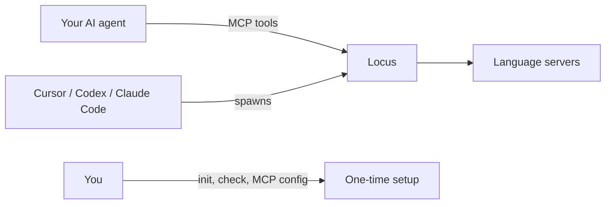

# Usage Guide

Locus is an MCP server your AI agent calls during conversations. You configure it once; the agent uses six tools to navigate code by meaning — not by searching for text strings.

This guide is written for **people who use AI agents to work on code**, whether or not you write code yourself.

## How it fits together

**MCP** (Model Context Protocol) is a standard way for AI tools to call specialized helpers. Instead of your agent guessing how code is structured, it can ask Locus: "Where is this function defined?" or "Who calls this?"

**Locus** sits between your agent and **language servers** — the same programs IDEs use for go-to-definition, find references, and error checking.



| Who | Does what |
|-----|-----------|
| **You** | Run `init` and `check` once; paste MCP config; reload your agent |
| **Your agent host** | Spawns `npx @paladini/locus-mcp serve` automatically |
| **Your agent** | Calls MCP tools (`locate`, `refs`, …) — never shell CLI commands |
| **Locus** | Translates tool calls into language-server requests |

> Your agent does **not** run `locus locate` in a terminal. It calls the MCP tool named `locate`. The host starts the server; you do not need to run `serve` manually.

## The six tools

| Tool | Use when you need to… |
|------|------------------------|
| [`locate`](./tools.md#locate) | Find a symbol by name or list symbols in a file |
| [`refs`](./tools.md#refs) | Find all references or implementations |
| [`hover`](./tools.md#hover) | Read type info and documentation |
| [`diagnostics`](./tools.md#diagnostics) | Check for errors and warnings |
| [`status`](./tools.md#status) | See if language servers are ready |
| [`rename`](./tools.md#rename) | Preview what a rename would affect |

Full parameters and examples: [tools.md](./tools.md)

---

## Setup walkthrough

### Before you start

1. Node.js 22+ installed
2. Language servers for your project's languages ([getting started — language servers](./getting-started.md#step-2-install-language-servers))
3. In your project root:
   ```bash
   npx @paladini/locus-mcp init
   npx @paladini/locus-mcp check
   ```

### Cursor

1. Create `.cursor/mcp.json` in your project (or edit global Cursor MCP settings):

```json
{
  "mcpServers": {
    "locus": {
      "command": "npx",
      "args": ["-y", "@paladini/locus-mcp", "serve"],
      "cwd": "/absolute/path/to/your/project"
    }
  }
}
```

2. Set `cwd` to your project's **absolute path**.
3. Reload MCP servers in Cursor (Command Palette → "MCP: Reload" or restart Cursor).

> **Screenshot placeholder:** Cursor MCP panel showing `locus` connected with six tools listed.

**Local development** (from a Locus clone):

```json
{
  "mcpServers": {
    "locus": {
      "command": "node",
      "args": ["packages/mcp/dist/bin.js", "serve"],
      "cwd": "/absolute/path/to/locus-mcp"
    }
  }
}
```

Point `cwd` at the project you want analyzed, not necessarily the Locus repo.

### Codex

Codex reads MCP config from `~/.codex/config.toml` (global) or `.codex/config.toml` (project-scoped).

```toml
[mcp_servers.locus]
command = "npx"
args = ["-y", "@paladini/locus-mcp", "serve"]
cwd = "/absolute/path/to/your/project"
```

For project config, `cwd = "."` resolves relative to the project root.

If language servers are slow to start, increase the timeout:

```toml
[mcp_servers.locus]
command = "npx"
args = ["-y", "@paladini/locus-mcp", "serve"]
cwd = "/absolute/path/to/your/project"
startup_timeout_sec = 30
```

Restart Codex CLI or reload the VS Code extension after saving.

Codex MCP docs: [developers.openai.com/codex/mcp](https://developers.openai.com/codex/mcp)

### Claude Code

Add the same JSON block as Cursor to Claude Code MCP settings:

```json
{
  "mcpServers": {
    "locus": {
      "command": "npx",
      "args": ["-y", "@paladini/locus-mcp", "serve"],
      "cwd": "/absolute/path/to/your/project"
    }
  }
}
```

Run `init` and `check` in your project first, then reload MCP.

---

## What to tell your agent

Agents work best when you are explicit. These patterns help:

### Find a symbol (use `locate`, not grep)

Grep finds text. Locus finds **symbols** — functions, classes, methods — with compiler accuracy.

**Prompt:**

> Find where `UserService.authenticate` is defined. Use Locus `locate`, not grep.

**What the agent should do:** Call MCP tool `locate` with `{ "name": "UserService.authenticate" }`, then use the returned file and line.

### Before a refactor (use `refs`)

**Prompt:**

> Before refactoring `parseConfig`, use Locus to list all references. Show me every caller.

**What the agent should do:** `locate` → get position → `refs` → review call sites before editing.

### After editing (use `diagnostics`)

**Prompt:**

> After your edits, run Locus diagnostics on `src/api/handler.ts` and fix any errors.

**What the agent should do:** Call `diagnostics` on changed files before moving on.

Optional: install the Cursor post-edit hook from `@paladini/adapters` to run diagnostics automatically after `Write`/`Edit` tool use.

### On session start (use `status`)

**Prompt:**

> Check Locus status and confirm TypeScript LSP is ready before we start.

**What the agent should do:** Call `status`; if servers are still starting, wait and retry.

### Locus vs grep — quick reference

| Need | Tool |
|------|------|
| Where is `Foo.bar` defined? | Locus `locate` |
| Who calls this function? | Locus `refs` |
| What type is this? | Locus `hover` |
| Any errors after my edit? | Locus `diagnostics` |
| Find the string `"TODO"` in comments | Grep |
| Search logs or config files | Grep |

---

## CLI commands (for you, not your agent)

```bash
npx @paladini/locus-mcp init    # Create config in your project (once)
npx @paladini/locus-mcp check   # Verify language servers are installed
npx @paladini/locus-mcp warm    # Pre-start servers (optional)
npx @paladini/locus-mcp serve   # Started by your MCP host — not manually
```

---

## Troubleshooting

### Run `check` first

```bash
npx @paladini/locus-mcp check
```

Fix any `MISSING` entries before expecting useful agent results.

### `server_starting`

The language server is still booting. Wait a few seconds, call `status`, or run:

```bash
npx @paladini/locus-mcp warm
```

### MCP server not appearing

- `cwd` must point to your **project root** (absolute path recommended)
- Node.js 22+ required
- Reload MCP after config changes

### Agent runs CLI instead of MCP tools

Tell it:

> Use the Locus MCP tool `locate`, not the CLI. Locus is configured as an MCP server.

---

## Next steps

- [Getting started](./getting-started.md) — first-time setup without LSP jargon
- [FAQ](./faq.md) — common questions
- [Who is Locus for?](./positioning.md) — fit and alternatives
- [Configuration](./configuration.md) — `locus.toml`, language overrides
- [Tools reference](./tools.md) — full MCP tool documentation
